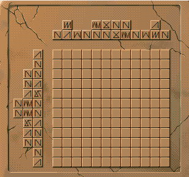
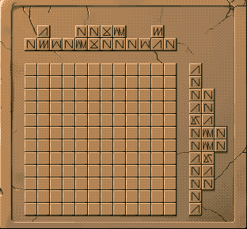

# YO-NO_solver
This piece of code is originally for the game YU-NO(この世の果てで恋を唄う少女YU-NO, 在世界尽头咏唱恋曲的少女YU-NO, YU-NO: A Girl Who Chants Love at the Bound of this World).

## Description
At one point of the game, u need to mark blocks on two slabs: 

Hints are:

*  symbol stands for unique number
+  symbol sequence shows the length of continuous blocks
+  length of blanks should be >=1 (between symbols) or >=0 (to the edge)

e.g. as to 'ABB':

* right:

	*  XX X X  (A=2, B=1)
	* X XXX XXX  (A=1, B=3)

* wrong:

	* X X X (A=B)
	* XX X X X (not 3 sections)
  
## My solution | What does the code do

* Class "State" stores mid states
+ func next() generates next states by comsuming a horizontal row
+ func valid() check generated states with vertical rows
+ func manual() offers a step-by-step method of choosing states through the procedure
+ solve the original situations in about 5 mins (hasn't try improvements)

## Bugs | To do

* does not support situations including empty line(has no symbols) 
* bad input format
* ugly style - -

## Answers to the game

[q1](./pic/a1.png)
[q2](./pic/a2.png)
